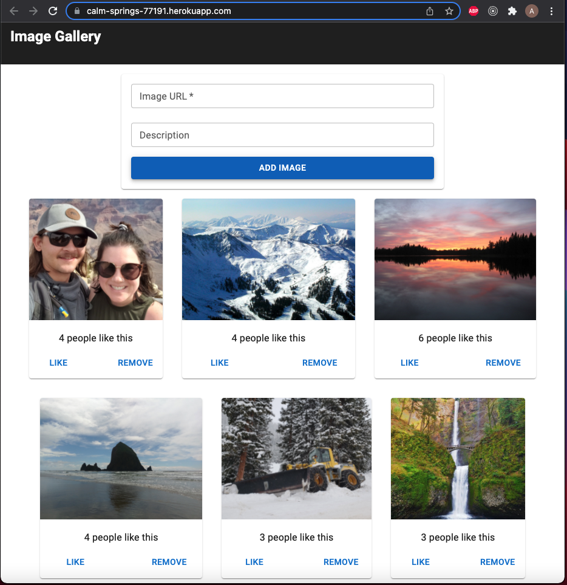
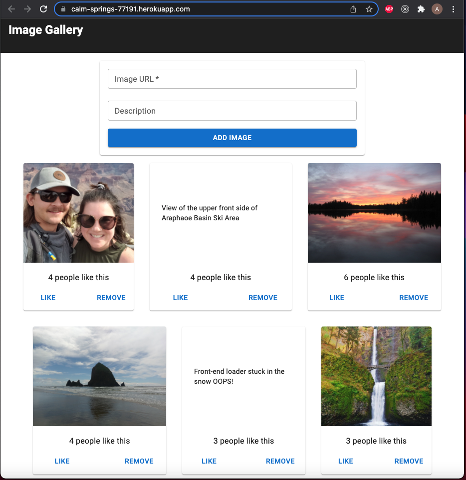

# PROJECT NAME

Weekend React Gallery

## Description

_Duration: Weekend_

This is a simple image gallery full-stack React app. It uses a PostgreSQL database to store all of the image information. The project comes with some of my own images included, but users may add their own via URL.

Images may be clicked to view their descriptions, and they may also be "Likes" and deleted.

The front end is built with React components (`App`, `GalleryList`, `GalleryForm`, and `GalleryItem`). The project was an excercise in conditional rendering and passing values/functions to components via `props`. The client makes requests to the server via `Axios`.

The back end is built with `Node.js` and `Express.js`. Queries to the `PostgreSQL` database are made with `pg`.

The deployed version of the app may be found [here](https://calm-springs-77191.herokuapp.com/).

## Screenshots

TODO:

- Implement image upload

### Prerequisites

- [Node.js](https://nodejs.org/en/)
- [PostgreSQL](https://www.postgresql.org/)

## Installation

1. Create a database named `react_gallery`,
2. The queries in the `database.sql` file are set up to create the necessary table and populate it with some starter images. [Postico](https://eggerapps.at/postico/) is recommended as that was used to create the queries,
3. Open up your editor of choice and run an `npm install`
4. Run `npm run server` in your terminal to start the server with `nodemon`
5. Run `npm run client` in your terminal to open the client in your browser

## Usage

1. Click the gallery item's "Like" button to increse the number of "Likes" for an image.
2. Click the item's image to see a description of the image.
3. Click the item's description to see the image again.
4. Click the item's "delete" button to remove the item from the gallery (caution: the item is removed from the database and may not be retrieved).
5. Use the form to enter an image URL (required) and a description to add a new item to the gallery.

## Built With

- React
- Node.js
- Express.js
- PostgreSQL
- Material UI v5

## Acknowledgement

I would like to thank [Prime Digital Academy](www.primeacademy.io) and [Dane Smith](https://github.com/DoctorHowser)

## Support

If you have suggestions or issues, please email me at [austin4191@gmail.com](www.google.com)
